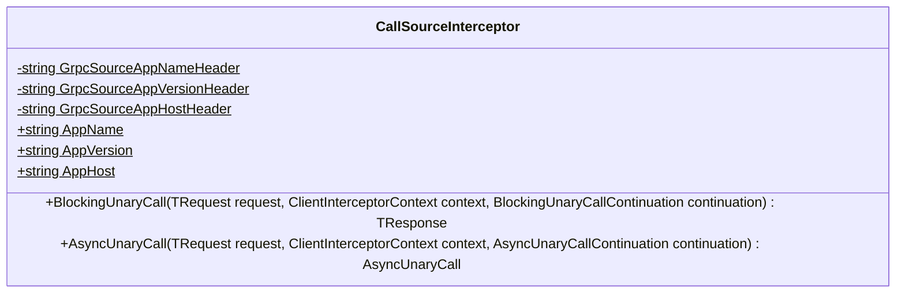
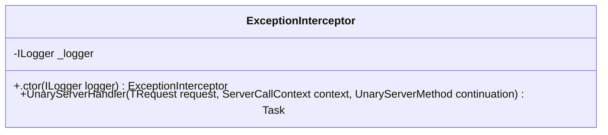
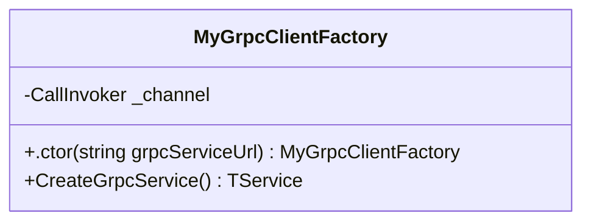

<!-- markdownlint-capture -->
<!-- markdownlint-disable -->

# Code Metrics

This file is dynamically maintained by a bot, *please do not* edit this by hand. It represents various [code metrics](https://aka.ms/dotnet/code-metrics), such as cyclomatic complexity, maintainability index, and so on.

## MyJetWallet.Sdk.Grpc :heavy_check_mark:

The *MyJetWallet.Sdk.Grpc.csproj* project file contains:

- 1 namespaces.
- 3 named types.
- 89 total lines of source code.
- Approximately 23 lines of executable code.
- The highest cyclomatic complexity is 7 :heavy_check_mark:.

  <strong id="myjetwallet-sdk-grpc">
    MyJetWallet.Sdk.Grpc :heavy_check_mark:
  </strong>

 

The `MyJetWallet.Sdk.Grpc` namespace contains 3 named types.

- 3 named types.
- 89 total lines of source code.
- Approximately 23 lines of executable code.
- The highest cyclomatic complexity is 7 :heavy_check_mark:.

  <strong id="callsourceinterceptor">
    CallSourceInterceptor :heavy_check_mark:
  </strong>

 

- The `CallSourceInterceptor` contains 8 members.
- 30 total lines of source code.
- Approximately 10 lines of executable code.
- The highest cyclomatic complexity is 4 :heavy_check_mark:.

| Member kind | Line number | Maintainability index | Cyclomatic complexity | Depth of inheritance | Class coupling | Lines of source / executable code |
| :-: | :-: | :-: | :-: | :-: | :-: | :-: |
| Property | <a href='https://github.com/MyJetWallet/MyJetWallet.Sdk.Grpc/blob/master/src/MyJetWallet.Sdk.Grpc/CallSourceInterceptor.cs#L10' title='string CallSourceInterceptor.AppHost'>10</a> | 100 | 2 :heavy_check_mark: | 0 | 0 | 1 / 0 |
| Property | <a href='https://github.com/MyJetWallet/MyJetWallet.Sdk.Grpc/blob/master/src/MyJetWallet.Sdk.Grpc/CallSourceInterceptor.cs#L8' title='string CallSourceInterceptor.AppName'>8</a> | 100 | 2 :heavy_check_mark: | 0 | 0 | 1 / 0 |
| Property | <a href='https://github.com/MyJetWallet/MyJetWallet.Sdk.Grpc/blob/master/src/MyJetWallet.Sdk.Grpc/CallSourceInterceptor.cs#L9' title='string CallSourceInterceptor.AppVersion'>9</a> | 100 | 2 :heavy_check_mark: | 0 | 0 | 1 / 0 |
| Method | <a href='https://github.com/MyJetWallet/MyJetWallet.Sdk.Grpc/blob/master/src/MyJetWallet.Sdk.Grpc/CallSourceInterceptor.cs#L26' title='AsyncUnaryCall<TResponse> CallSourceInterceptor.AsyncUnaryCall<TRequest, TResponse>(TRequest request, ClientInterceptorContext<TRequest, TResponse> context, AsyncUnaryCallContinuation<TRequest, TResponse> continuation)'>26</a> | 73 | 4 :heavy_check_mark: | 0 | 5 | 9 / 4 |
| Method | <a href='https://github.com/MyJetWallet/MyJetWallet.Sdk.Grpc/blob/master/src/MyJetWallet.Sdk.Grpc/CallSourceInterceptor.cs#L16' title='TResponse CallSourceInterceptor.BlockingUnaryCall<TRequest, TResponse>(TRequest request, ClientInterceptorContext<TRequest, TResponse> context, BlockingUnaryCallContinuation<TRequest, TResponse> continuation)'>16</a> | 73 | 4 :heavy_check_mark: | 0 | 4 | 9 / 4 |
| Field | <a href='https://github.com/MyJetWallet/MyJetWallet.Sdk.Grpc/blob/master/src/MyJetWallet.Sdk.Grpc/CallSourceInterceptor.cs#L14' title='string CallSourceInterceptor.GrpcSourceAppHostHeader'>14</a> | 93 | 0 :heavy_check_mark: | 0 | 0 | 1 / 1 |
| Field | <a href='https://github.com/MyJetWallet/MyJetWallet.Sdk.Grpc/blob/master/src/MyJetWallet.Sdk.Grpc/CallSourceInterceptor.cs#L12' title='string CallSourceInterceptor.GrpcSourceAppNameHeader'>12</a> | 93 | 0 :heavy_check_mark: | 0 | 0 | 1 / 1 |
| Field | <a href='https://github.com/MyJetWallet/MyJetWallet.Sdk.Grpc/blob/master/src/MyJetWallet.Sdk.Grpc/CallSourceInterceptor.cs#L13' title='string CallSourceInterceptor.GrpcSourceAppVersionHeader'>13</a> | 93 | 0 :heavy_check_mark: | 0 | 0 | 1 / 1 |

<a href="#CallSourceInterceptor-class-diagram">:link: to `CallSourceInterceptor` class diagram</a>

<a href="#myjetwallet-sdk-grpc">:top: back to MyJetWallet.Sdk.Grpc</a>

  <strong id="exceptioninterceptor">
    ExceptionInterceptor :heavy_check_mark:
  </strong>

 

- The `ExceptionInterceptor` contains 3 members.
- 34 total lines of source code.
- Approximately 11 lines of executable code.
- The highest cyclomatic complexity is 7 :heavy_check_mark:.

| Member kind | Line number | Maintainability index | Cyclomatic complexity | Depth of inheritance | Class coupling | Lines of source / executable code |
| :-: | :-: | :-: | :-: | :-: | :-: | :-: |
| Field | <a href='https://github.com/MyJetWallet/MyJetWallet.Sdk.Grpc/blob/master/src/MyJetWallet.Sdk.Grpc/ExceptionInterceptor.cs#L12' title='ILogger ExceptionInterceptor._logger'>12</a> | 100 | 0 :heavy_check_mark: | 0 | 1 | 1 / 0 |
| Method | <a href='https://github.com/MyJetWallet/MyJetWallet.Sdk.Grpc/blob/master/src/MyJetWallet.Sdk.Grpc/ExceptionInterceptor.cs#L14' title='ExceptionInterceptor.ExceptionInterceptor(ILogger<ExceptionInterceptor> logger)'>14</a> | 96 | 1 :heavy_check_mark: | 0 | 2 | 4 / 1 |
| Method | <a href='https://github.com/MyJetWallet/MyJetWallet.Sdk.Grpc/blob/master/src/MyJetWallet.Sdk.Grpc/ExceptionInterceptor.cs#L19' title='Task<TResponse> ExceptionInterceptor.UnaryServerHandler<TRequest, TResponse>(TRequest request, ServerCallContext context, UnaryServerMethod<TRequest, TResponse> continuation)'>19</a> | 61 | 7 :heavy_check_mark: | 0 | 8 | 24 / 10 |

<a href="#ExceptionInterceptor-class-diagram">:link: to `ExceptionInterceptor` class diagram</a>

<a href="#myjetwallet-sdk-grpc">:top: back to MyJetWallet.Sdk.Grpc</a>

  <strong id="mygrpcclientfactory">
    MyGrpcClientFactory :heavy_check_mark:
  </strong>

 

- The `MyGrpcClientFactory` contains 3 members.
- 14 total lines of source code.
- Approximately 2 lines of executable code.
- The highest cyclomatic complexity is 1 :heavy_check_mark:.

| Member kind | Line number | Maintainability index | Cyclomatic complexity | Depth of inheritance | Class coupling | Lines of source / executable code |
| :-: | :-: | :-: | :-: | :-: | :-: | :-: |
| Field | <a href='https://github.com/MyJetWallet/MyJetWallet.Sdk.Grpc/blob/master/src/MyJetWallet.Sdk.Grpc/MyGrpcClientFactory.cs#L14' title='CallInvoker MyGrpcClientFactory._channel'>14</a> | 100 | 0 :heavy_check_mark: | 0 | 1 | 1 / 0 |
| Method | <a href='https://github.com/MyJetWallet/MyJetWallet.Sdk.Grpc/blob/master/src/MyJetWallet.Sdk.Grpc/MyGrpcClientFactory.cs#L16' title='MyGrpcClientFactory.MyGrpcClientFactory(string grpcServiceUrl)'>16</a> | 96 | 1 :heavy_check_mark: | 0 | 2 | 4 / 1 |
| Method | <a href='https://github.com/MyJetWallet/MyJetWallet.Sdk.Grpc/blob/master/src/MyJetWallet.Sdk.Grpc/MyGrpcClientFactory.cs#L21' title='TService MyGrpcClientFactory.CreateGrpcService<TService>()'>21</a> | 100 | 1 :heavy_check_mark: | 0 | 2 | 4 / 1 |

<a href="#MyGrpcClientFactory-class-diagram">:link: to `MyGrpcClientFactory` class diagram</a>

<a href="#myjetwallet-sdk-grpc">:top: back to MyJetWallet.Sdk.Grpc</a>

<a href="#myjetwallet-sdk-grpc">:top: back to MyJetWallet.Sdk.Grpc</a>

## Metric definitions

  - **Maintainability index**: Measures ease of code maintenance. Higher values are better.
  - **Cyclomatic complexity**: Measures the number of branches. Lower values are better.
  - **Depth of inheritance**: Measures length of object inheritance hierarchy. Lower values are better.
  - **Class coupling**: Measures the number of classes that are referenced. Lower values are better.
  - **Lines of source code**: Exact number of lines of source code. Lower values are better.
  - **Lines of executable code**: Approximates the lines of executable code. Lower values are better.

## Mermaid class diagrams

##### `CallSourceInterceptor` class diagram

##### `ExceptionInterceptor` class diagram

##### `MyGrpcClientFactory` class diagram

*This file is maintained by a bot.*

<!-- markdownlint-restore -->
